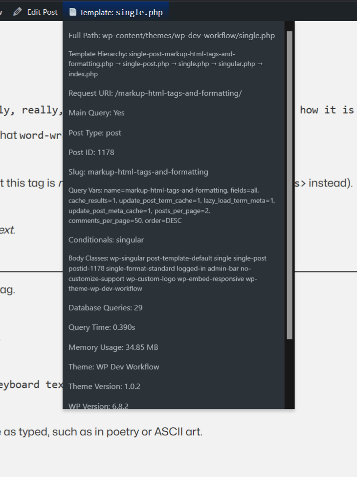
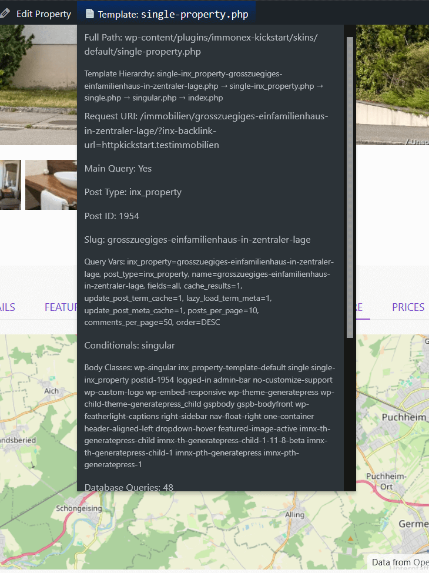

# Current Template Insights

Displays the current template file and key page details in the WordPress admin bar for logged-in administrators.
No setup required: just install, activate, and see the info bar on any front-end page.


---

## Features:
- Shows “📄 Template: <filename>” in the front-end admin bar
- Details on hover/click: full template path, post ID, post type, slug, theme name & version, locale, body classes, query vars, conditionals, DB query count, memory usage, and more
- No settings page, no configuration
- Works with classic and block/FSE themes (special info for block themes)
- Developer-friendly, lightweight, no bloat

---

## Installation

1. Download and install from the [WordPress.org plugin page](https://wordpress.org/plugins/current-template-insights/),  
   or clone this repository into your `wp-content/plugins` folder.
2. Activate the plugin from **Plugins → Installed Plugins**.
3. View the WordPress admin bar on the frontend to see the current template.

---

## FAQ

**Q:** Is there a settings page?  
**A:** No settings page — just install and go. All information is displayed in the admin bar for logged-in admins.


**Q:** Why can't i see the template information on the front-end?  
**A:** The plugin displays its information in the WordPress admin bar. If the admin bar is disabled in the frontend (via user settings, code, or another plugin), then no output will be displayed.

**Q:** Can I extend or customize the details shown?  
**A:** Yes, developers can use the `current_template_insights_details` filter hook to add or modify the debug info.

**Q:** Does this work with Full Site Editing (block) themes?  
**A:** Yes! With block (Full Site Editing) themes, WordPress uses a core PHP file (`template-canvas.php`) as a wrapper for block templates. The plugin displays the actual PHP template in use. (Future versions may add a more descriptive message for block themes.)

---

## Customization

You can modify or extend the details shown using the `current_template_insights_details` filter.

Example:

```php
/**
 * Example filter function for modifying the $details array 
 *
 * This filter function will: 
 * - Changes title of "Template Hierarchy" to just "Hierarchy" and changes title of "Slug" to "Permalink Slug"
 * - Completely removes "DB Queries" and "Locale"
 * - Adds new infos "Charset" and "Theme Stylesheet URL"
*/
function my_adjusted_template_details( $details ) {
    $new_details = [];

    foreach ( $details as $key => $value ) {
        // Change title "Template Hierarchy" to "Hierarchy"
        if ( $key === __('Template Hierarchy', 'current-template-insights') ) {
            $new_details[ __('Hierarchy', 'current-template-insights') ] = $value;
        }
        // Change title "Slug" to "Permalink Slug"
        elseif ( $key === __('Slug', 'current-template-insights') ) {
            $new_details[ __('Permalink Slug', 'current-template-insights') ] = $value;
        }
        // Skip (remove) "DB Queries" and "Locale"
        elseif ( $key === __('DB Queries', 'current-template-insights') || $key === __('Locale', 'current-template-insights') ) {
            continue;
        }
        // Otherwise, just copy over
        else {
            $new_details[ $key ] = $value;
        }
    }

    // Add custom "Charset" and "Theme Stylesheet URL" details at the end
    $new_details[ __('Charset', 'current-template-insights') ] = esc_html( get_bloginfo('charset') );
    $new_details[ __('Theme Stylesheet URL', 'current-template-insights') ] = esc_html( get_bloginfo('stylesheet_url') );

    return $new_details;
}
add_filter('current_template_insights_details', 'my_adjusted_template_details'); 
```

---

## Screenshots

1. **Admin bar showing current template and details**  
   

2. **Example with CPT and extended debug info**  
   
   
---

## Links

WordPress.org Plugin Page: [Current Template Insights](https://wordpress.org/plugins/current-template-insights/)  

Developer GitHub Repository: [GitHub - macurious/current-template-insights](https://github.com/macurious/current-template-insights)  

--- 

## License

This plugin is licensed under the [GPL v2 or later](https://www.gnu.org/licenses/old-licenses/gpl-2.0.html).  
You are free to use, modify, and redistribute it under the same license terms.